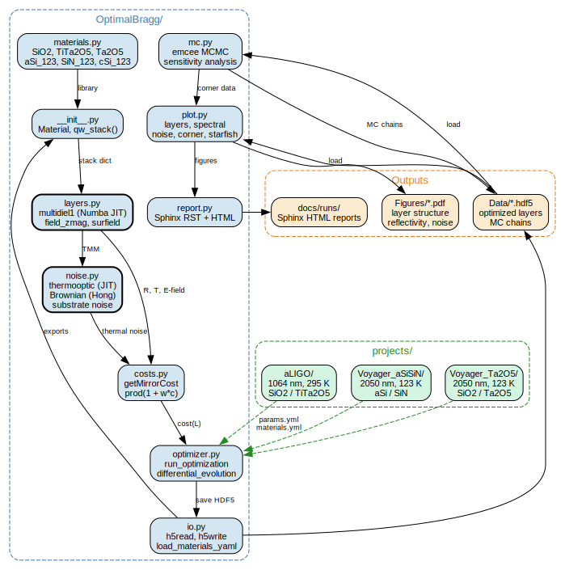

[](https://github.com/CaltechExperimentalGravity/OptimalBragg/actions/workflows/ci.yml)

# OptimalBragg: Mirror Coating Design by Global Optimization

Code to optimize HR mirror dielectric stack designs for gravitational wave detector test masses.
Designs are optimized via `scipy.optimize.differential_evolution`, balancing transmissivity,
thermal noise, manufacturing tolerance, surface E-field, and absorption constraints.

For a detailed architecture reference, see **[CODEMAP.md](CODEMAP.md)**.

## Architecture



The `OptimalBragg` package provides all physics, optimization, and visualization.
Project-specific configurations live in `projects/`, each with:
- `materials.yml` — material properties referencing the central materials library
- `ETM_params.yml` / `ITM_params.yml` — cost function weights and optimizer settings
- `Data/` — HDF5 optimizer and MC output (gitignored)
- `Figures/` — generated plots (gitignored)

## How to Install

1. Clone the repository:
   ```bash
   git clone https://github.com/CaltechExperimentalGravity/OptimalBragg.git
   cd OptimalBragg
   ```
2. Create the conda environment and install the package:
   ```bash
   conda env create -f environment.yml
   conda activate coatingDev
   pip install -e .
   ```
   Key dependencies: numpy, scipy, matplotlib, numba (>=0.56), emcee, arviz, h5py, pytest.

## Quick Start

### Run a coating optimization

Using the CLI (from repo root):

```bash
optimalbragg optimize projects/aLIGO/ETM_params.yml
optimalbragg optimize projects/aLIGO/ITM_params.yml
```

Or from a project directory:

```bash
cd projects/aLIGO && python mkETM.py
```

Output: `Data/ETM/ETM_Layers_YYMMDD_HHMMSS.hdf5`

### Monte Carlo sensitivity analysis

```bash
optimalbragg mc Data/ETM/ETM_Layers_YYMMDD_HHMMSS.hdf5 5000
```

Uses `emcee` (20 walkers, 3D parameter space) to perturb refractive indices and layer thicknesses by 0.5% Gaussian.

### Visualization

```bash
optimalbragg plot Data/ETM/ETM_Layers_YYMMDD_HHMMSS.hdf5
optimalbragg corner Data/ETM/ETM_MC.hdf5
```

## Optimal Objectives

For the mirror coatings, we have many constraints to satisfy:

1. Transmissivity at the primary laser wavelength (e.g. 5 ppm at 1064 nm).
2. Transmissivity at auxiliary wavelengths (532 nm, optical lever).
3. Minimize Brownian thermal noise.
4. Minimize Thermo-Optic noise.
5. Minimize sensitivity of transmissivity to coating deposition errors.
6. Minimize E-field at HR surface.
7. Layer thickness uniformity.

Each objective is a weighted term in a multiplicative cost function: `C = prod(1 + w_i * c_i)`. See [CODEMAP.md](CODEMAP.md) for the full cost function breakdown.

## Active Projects

| Project | Materials | Primary wavelength | Temperature |
|---------|-----------|-------------------|-------------|
| `projects/aLIGO/` | SiO2 / TiTa2O5 | 1064 nm | 295 K |
| `projects/SFG/` | SiO2 / Ta2O5 | 1064 nm | 295 K |
| `projects/Voyager_aSiSiN/` | a-Si / SiN | 2050 nm | 123 K |
| `projects/Voyager_Ta2O5/` | Ta2O5 / SiO2 | 2050 nm | 123 K |

## Running Tests

```bash
pytest tests/ -v -k "not slow"           # Unit tests (~2 sec)
pytest tests/test_integration.py -m slow  # Integration test (~30 sec)
python benchmarks/bench_multidiel1.py     # Transfer matrix benchmark
python benchmarks/bench_thermooptic.py    # Thermooptic JIT vs numpy
```

## Paper draft

A paper draft of this work lives at [this git repo](https://github.com/CaltechExperimentalGravity/OptimalCoatingDesign).
