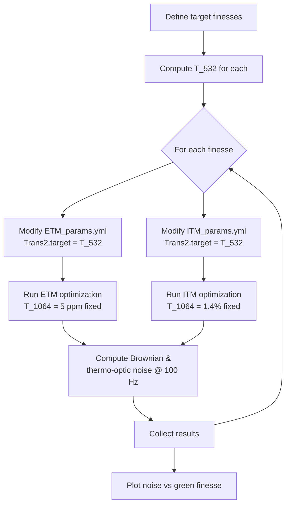

# aLIGO Coating Design

Optimized HR mirror coatings for Advanced LIGO test masses: SiO2/TiTa2O5 multilayer stacks on fused silica substrates at 1064 nm, 295 K.

## Mirror Configurations

| Parameter | ETM | ITM |
|-----------|-----|-----|
| T @ 1064 nm | 5 ppm | 1.4% |
| T @ 532 nm | 3.2% | 2.0% |
| Bilayer pairs | 21 | 10 |
| Beam radius | 6.2 cm | 5.5 cm |
| Brownian target | 24.0 (proxy) | 11.0 (proxy) |
| Thermo-optic target | 1.6e-42 m²/Hz | 3.6e-44 m²/Hz |

Both use a half-wave SiO2 cap (`hwcap: L`) for surface E-field stability.

## Running Optimizations

```bash
optimalbragg optimize projects/aLIGO/ETM_params.yml
optimalbragg optimize projects/aLIGO/ITM_params.yml
```

Or use the wrapper scripts:
```bash
cd projects/aLIGO && python mkETM.py
```

## Green Finesse Sweep

### Motivation

The arm cavities use 532 nm (frequency-doubled) light for auxiliary locking. The green cavity finesse is set by the mirror transmissions at 532 nm. Higher green finesse improves the PDH signal but forces the optimizer to constrain T_532, potentially increasing thermal noise at 1064 nm.

This sweep quantifies the thermal noise penalty as a function of green finesse.

### Physics

For a symmetric green cavity with equal mirror transmissions T at 532 nm:

$$\mathcal{F} = \frac{\pi\,(1-T)}{T\,(2-T)}$$

Solving for T given a target finesse:

$$T = \frac{(2\mathcal{F} + \pi) - \sqrt{(2\mathcal{F} + \pi)^2 - 4\pi\mathcal{F}}}{2\mathcal{F}}$$

| Green Finesse | T_532 (each mirror) |
|---------------|-------------------|
| 100 | 1.57% |
| 300 | 0.524% |
| 1,000 | 0.157% |
| 3,000 | 524 ppm |
| 10,000 | 157 ppm |

### Sweep Logic



### Running the Sweep

```bash
cd projects/aLIGO
python sweep_green_finesse.py
```

Output: `Figures/green_finesse_sweep.pdf`

## Directory Structure

```
projects/aLIGO/
├── materials.yml          # SiO2/TiTa2O5, 1064 nm, 295 K
├── ETM_params.yml         # ETM cost weights and optimizer settings
├── ITM_params.yml         # ITM cost weights and optimizer settings
├── mkETM.py / mkITM.py    # Thin wrapper scripts
├── sweep_green_finesse.py # Green finesse sweep study
├── Data/                  # HDF5 output (gitignored)
└── Figures/               # Generated plots (gitignored)
```
