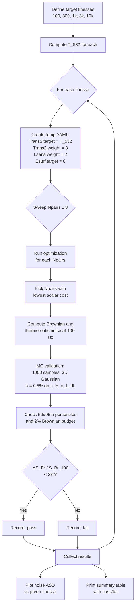

# aLIGO Coating Design

Optimized HR mirror coatings for Advanced LIGO test masses: SiO2/TiTa2O5
multilayer stacks on fused silica substrates at 1064 nm, 295 K.

## Current Configurations

| Parameter | ETM | ITM |
|-----------|-----|-----|
| T @ 1064 nm | 5 ppm | 1.4% |
| T @ 532 nm | 3.2% | 2.0% |
| Bilayer pairs | 21 | 10 |
| Beam radius | 6.2 cm | 5.5 cm |

Configuration files: `ETM_params.yml`, `ITM_params.yml`, `materials.yml`.

Run from repo root:
```bash
optimalbragg optimize projects/aLIGO/ETM_params.yml
optimalbragg optimize projects/aLIGO/ITM_params.yml
```

---

## Green Finesse Sweep

### What we want

Find coating designs for ETM and ITM across a range of green (532 nm) cavity
finesses, and measure the thermal noise penalty. The deliverable is a plot of
Brownian and thermo-optic noise ASD at 100 Hz vs green finesse.

**Finesse points**: 100, 300, 1000, 3000, 10000

The cavity has equal T_532 on both mirrors. The finesse-to-transmission
relation (neglecting losses):

$$\mathcal{F} = \frac{\pi\,(1-T)}{T\,(2-T)}
\quad\Longrightarrow\quad
T = \frac{(2\mathcal{F} + \pi) - \sqrt{(2\mathcal{F} + \pi)^2 - 4\pi\mathcal{F}}}{2\mathcal{F}}$$

| Green Finesse | T_532 (each mirror) |
|---------------|-------------------|
| 100 | 1.57% |
| 300 | 0.524% |
| 1,000 | 0.157% |
| 3,000 | 524 ppm |
| 10,000 | 157 ppm |

### Requirements

**Hard constraints:**

1. **T_1064 must be accurate.** The ETM must stay at 5 ppm and the ITM at
   1.4%. These are interferometer operating points — there is no room to
   trade IR transmission for better green performance. Keep Trans1 weight
   high (≥ 5).

2. **Brownian noise increase < 2%.** Relative to the F = 100 baseline
   design, no finesse point should increase the Brownian noise by more than
   2%. If a design at some finesse cannot meet this, it tells us that
   finesse is not achievable without a noise penalty.

**Soft constraints:**

3. **T_532 is approximate.** We need T_532 in the right ballpark to set the
   finesse, but ±10–20% is acceptable. The exact PDH signal strength is less
   critical than keeping thermal noise low. Trans2 weight can be lower than
   Trans1 (e.g. 2–3 instead of 5).

4. **Surface E-field** should be minimized. Set `Esurf.target = 0` (drive
   to zero) with nonzero weight. The half-wave SiO2 cap provides a good
   starting point; the optimizer should push further.

### What we can change

For each finesse point, the sweep adjusts:

| Parameter | YAML key | What it controls |
|-----------|----------|-----------------|
| Green transmission target | `costs.Trans2.target` | Set to T_532 from table above |
| Number of bilayers | `misc.Npairs` | Try baseline ± 3 (ETM: 18–24, ITM: 7–13) |

**What stays fixed:**
- `costs.Trans1.target` and `costs.Trans1.weight` — IR transmission is non-negotiable
- `costs.Brownian.target` and `costs.Brownian.weight` — thermal noise budget
- `costs.Thermooptic.target` and `costs.Thermooptic.weight` — TO noise budget
- Materials, substrate, beam radii, wavelength

### How to tune the costs

The optimizer minimizes `C = ∏(1 + w_i · c_i)`. Each cost term is
independently weighted. The key tension is between Trans2 (green
transmission) and Brownian/Thermooptic (thermal noise):

- **High Trans2 weight** forces the optimizer to hit T_532 precisely,
  potentially distorting layers and increasing noise.
- **Low Trans2 weight** lets the optimizer sacrifice T_532 accuracy to keep
  layers closer to quarter-wave and noise low.
- **Lsens weight > 0** prevents the optimizer from finding fragile designs
  that hit the T_532 target through a narrow interference feature.

Current weights (updated in ETM/ITM_params.yml):
- Trans1: 5 (IR transmission is critical)
- Trans2: 3 (green tolerance is loose)
- Brownian: 2
- Thermooptic: 2
- Lsens: 2 (penalizes fragile designs)
- Esurf: 2, target = 0 (minimize surface field)

If the optimizer struggles to converge at high finesse (scalar cost >> 1),
try reducing Trans2 weight further or adding bilayers.

### Validation

Each design is validated via Monte Carlo sampling (same approach as
`optimalbragg mc`): draw ~1000 samples from a 3D Gaussian with σ = 0.5%
perturbations on n_H, n_L, and layer thickness. For each sample, compute
T_1064, T_532, and thermal noise at 100 Hz. Check:

- **5th/95th percentiles of T_1064** — must stay close to target
- **5th/95th percentiles of T_532** — acceptable if within ~20% of target
- **95th percentile of Brownian noise** — must be within the 2% budget

### Acceptance criterion

A design at finesse F passes if:

$$\frac{S_\text{Br}(F) - S_\text{Br}(100)}{S_\text{Br}(100)} < 0.02$$

where S_Br is the Brownian noise PSD at 100 Hz. Designs that fail this
criterion reveal the maximum achievable green finesse within the noise budget.

### Sweep logic



## Directory Contents

```
projects/aLIGO/
├── materials.yml      # SiO2/TiTa2O5 on fused silica, 1064 nm, 295 K
├── ETM_params.yml     # Cost weights, optimizer settings (21 bilayers)
├── ITM_params.yml     # Cost weights, optimizer settings (10 bilayers)
├── Data/              # HDF5 optimizer and MC output (gitignored)
└── Figures/           # Generated plots (gitignored)
```
